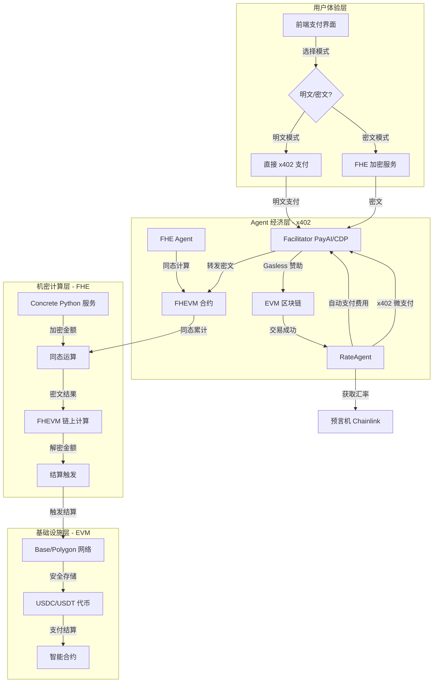

# 终极集成实施方案：x402 + FHE Gateway (EVM)

**项目名称：** x402 + FHE Gateway (EVM)  
**项目目标：** 打造一个基于 **EVM 网络**（Base/Polygon）的 **Agentic Finance** 解决方案，结合 **x402 协议**的 Gasless 支付与 **FHE 同态加密**的机密支付，实现 Agent 驱动的自主经济行为。

**核心定位：** x402 (EVM) + FHE (EVM) = Gasless + 机密 + Agentic Finance

---

## 一、集成架构与组件概览

本项目将核心功能划分为四个层次：用户体验层、Agent 经济层（x402）、机密计算层（FHE）和金融基础设施层（EVM）。

| 层次 | 组件 | 作用 | 核心技术 |
| :--- | :--- | :--- | :--- |
| **用户体验层** | PayAgent Gateway Web App | 支持明文/密文双模式的支付界面。 | React/Next.js, Ethers.js/Viem, Relayer SDK |
| **Agent 经济层** | x402 Facilitator & Agents | 实现 Gasless 交易、Agent 服务付费、原子化结算。 | **PayAI/CDP Facilitator** (EVM x402), **x402 Client SDK** |
| **机密计算层** | FHE 服务 & FHEVM | 提供加密/解密和同态计算能力。 | **Concrete Python** (后端服务), **Zama FHEVM** (EVM 合约) |
| **金融基础设施层** | EVM Networks & Tokens | 提供 EVM 网络支持和稳定币（USDC/USDT）。 | **Base/Polygon**, **ERC-20 Tokens** |

### 架构流程图



---

## 二、技术实施细节与关键 API 调用

### 1. Agent 经济层：x402 协议集成 (EVM)

**目标：** 实现 Gasless 支付和 `RateAgent` 的按需付费调用。

| 步骤 | 描述 | 关键 x402 工具 (参考官方文档) | 示例用法/SDK |
| :--- | :--- | :--- | :--- |
| **1.1 Facilitator 选择** | 选择 PayAI 或 Coinbase CDP Facilitator，配置 Facilitator URL。 | PayAI: `https://facilitator.payai.network`<br>CDP: `https://api.cdp.coinbase.com/x402` | **Facilitator URL:** <br> `const facilitatorUrl = 'https://facilitator.payai.network';` <br> (参考: https://docs.payai.network/x402/quickstart) |
| **1.2 x402 服务器部署** | 部署 EVM x402 服务器（Express/FastAPI/Hono），配置收款地址和路由价格。 | `@payai-network/x402-server` 或 `x402` Python 包 | **Express 示例:** <br> `npm install @payai-network/x402-server` <br> `app.use(x402Middleware({ facilitatorUrl, payTo, routes }))` <br> (参考: https://docs.payai.network/x402/servers/typescript/express) |
| **1.3 Gasless 交易** | 客户端使用 x402 Client SDK 发起支付，Facilitator 代付 Gas。 | `@payai-network/x402-client` 或 `x402` Python 包 | **客户端示例:** <br> `npm install @payai-network/x402-client` <br> `const client = createX402Client({ facilitatorUrl, network, privateKey })` <br> `await client.request({ url: 'https://api.example.com/protected' })` <br> (参考: https://docs.payai.network/x402/clients/typescript/axios) |
| **1.4 RateAgent 逻辑** | 编写 `RateAgent`，其核心逻辑是：1. 调用 Chainlink 获取 USDC/USD 汇率；2. 通过 x402 协议向 Facilitator 发起微支付。 | x402 Client SDK, Chainlink Price Feed | **Agent 支付逻辑:** <br> `const rate = await chainlink.getPrice('USDC/USD')` <br> `await x402Client.request({ url: facilitatorUrl + '/rate', amount: 0.001 })` <br> (参考: https://docs.payai.network/x402/clients/introduction) |
| **1.5 原子化结算** | 在收款成功事件触发后，Agent 自动执行以下逻辑：`RateAgent` 支付费用 → 平台佣金扣除 → 余额入账。 | x402 协议的原子性支付特性，将多笔微支付逻辑打包。 | **Facilitator 逻辑:** <br> 监听交易成功后，触发 Agent 支付和佣金转账逻辑。 <br> (参考: https://docs.payai.network/x402/reference) |

### 2. 机密计算层：FHE 集成 (Zama FHEVM)

**目标：** 实现机密支付，保护交易金额隐私。

| 步骤 | 描述 | 关键 FHE 工具 (参考官方文档) | 示例用法/SDK |
| :--- | :--- | :--- | :--- |
| **2.1 FHEVM 合约开发** | 创建 Solidity 合约，集成 Zama FHEVM 库，实现同态加法和乘法运算。 | Zama FHEVM, Hardhat/Foundry | **合约开发:** <br> `npm install @zama-ai/fhevm` <br> `import { FHE } from "@zama-ai/fhevm/contracts/FHE.sol"` <br> (参考: https://docs.zama.ai/protocol/relayer-sdk-guides) |
| **2.2 前端加密集成** | 使用 Relayer SDK 在前端实现金额加密，与 FHEVM 合约交互。 | `@zama-fhe/relayer-sdk` | **前端集成:** <br> `npm install @zama-fhe/relayer-sdk` <br> `import { init } from '@zama-fhe/relayer-sdk'` <br> `const instance = await init({ publicKey, relayerURL })` <br> `const encrypted = await instance.encrypt32(amount)` <br> (参考: https://docs.zama.ai/protocol/relayer-sdk-guides) |
| **2.3 链下 FHE 服务** | 使用 Concrete Python 提供链下 FHE 计算服务，与 FHEVM 配合使用。 | Concrete Python, FastAPI | **Python 服务:** <br> `pip install concrete-python` <br> `from concrete import fhe` <br> `@fhe.compiler({"x": "encrypted"})` <br> (参考: https://docs.zama.ai/concrete) |
| **2.4 同态运算实现** | 在 FHEVM 合约中实现同态加法（累计支付）和同态乘法（汇率换算）。 | FHEVM Solidity Library | **合约方法:** <br> `function addPayment(bytes32 encryptedAmount) public` <br> `function applyRate(bytes32 encryptedAmount, uint256 rate) public` <br> (参考: https://docs.zama.ai/protocol) |
| **2.5 解密服务** | 在结算时使用 Relayer SDK 或 Concrete Python 进行解密，获取最终金额。 | Relayer SDK, Concrete Python | **解密逻辑:** <br> `const decrypted = await instance.decrypt(encrypted)` <br> 或 <br> `decrypted = circuit.decrypt(ciphertext)` <br> (参考: https://docs.zama.ai/protocol/relayer-sdk-guides) |

### 3. 金融基础设施层：EVM 网络集成

**目标：** 使用 EVM 网络（Base/Polygon）和稳定币（USDC/USDT）进行支付结算。

| 步骤 | 描述 | 关键工具 | 示例用法/SDK |
| :--- | :--- | :--- | :--- |
| **3.1 网络配置** | 选择 EVM 网络（Base Sepolia 测试网或 Base/Polygon 主网），配置 RPC URL。 | Ethers.js, Viem | **网络配置:** <br> `const provider = new ethers.JsonRpcProvider('https://sepolia.base.org')` <br> 或 <br> `import { createPublicClient, http } from 'viem'` <br> `const client = createPublicClient({ chain: baseSepolia, transport: http() })` |
| **3.2 代币合约** | 使用 USDC/USDT ERC-20 代币合约地址，支持 EIP-3009 转账。 | ERC-20, EIP-3009 | **代币地址:** <br> Base Sepolia USDC: `0x036CbD53842c5426634e7929541eC2318f3dCF7e` <br> Base Mainnet USDC: `0x833589fCD6eDb6E08f4c7C32D4f71b54bdA02913` |
| **3.3 钱包集成** | 集成 MetaMask 或其他 EVM 钱包，支持用户签名和交易。 | Ethers.js Wallet Adapter, Viem | **钱包连接:** <br> `const provider = new ethers.BrowserProvider(window.ethereum)` <br> `const signer = await provider.getSigner()` <br> 或 <br> `import { createWalletClient, custom } from 'viem'` <br> `const walletClient = createWalletClient({ chain: baseSepolia, transport: custom(window.ethereum) })` |
| **3.4 交易监控** | 监听链上交易状态，确认支付成功。 | Ethers.js, Viem | **交易监听:** <br> `await tx.wait()` <br> 或 <br> `await publicClient.waitForTransactionReceipt({ hash: txHash })` |

---

## 三、实施路线图

### 3.1 Hackathon 快速路线图（3-5 天）

| 日期 | 阶段目标 | 核心任务 | 交付物 |
| :--- | :--- | :--- | :--- |
| **Day 1** | **x402 Gasless 支付闭环** | 1. 选择 Facilitator（PayAI 或 CDP）。2. 部署 x402 服务器（Express/FastAPI）。3. 创建 x402 客户端。4. 跑通最简 Gasless USDC 付款 Demo。 | x402 服务器、客户端 Demo、Gasless 交易日志。 |
| **Day 2** | **FHEVM 合约基础** | 1. 初始化 Hardhat/Foundry 项目。2. 集成 Zama FHEVM 库。3. 实现基础 FHE 合约。4. 部署到 Base Sepolia。 | FHEVM 合约、部署脚本、测试报告。 |
| **Day 3** | **前端 FHE 集成** | 1. 安装 Relayer SDK。2. 实现前端加密/解密。3. 集成 FHEVM 合约交互。4. 测试加密支付流程。 | 前端 FHE 工具、加密支付 Demo。 |
| **Day 4** | **x402 + FHE 集成** | 1. 结合 x402 和 FHE 加密。2. 实现机密 Gasless 支付。3. 端到端测试。4. 创建演示视频。 | 完整支付流程、演示视频。 |
| **Day 5** | **文档与优化** | 1. 完善 README.md。2. 撰写技术文档。3. 性能优化。4. 准备提交材料。 | 完整 GitHub Repo、技术文档、申请草稿。 |

### 3.2 完整集成路线图（4 周）

| 周次 | 阶段目标 | 核心任务 | 交付物 |
| :--- | :--- | :--- | :--- |
| **Week 1** | **FHEVM 合约开发** | 1. 搭建 Hardhat/Foundry 项目。2. 集成 Zama FHEVM。3. 实现同态加法和乘法。4. 部署到 Base Sepolia。 | FHEVM 合约、部署脚本、测试用例。 |
| **Week 2** | **前端集成** | 1. 安装 Relayer SDK。2. 实现前端加密/解密。3. 集成 x402 客户端。4. 测试端到端流程。 | 前端工具模块、加密支付 UI、测试报告。 |
| **Week 3** | **x402 + FHE 集成** | 1. 结合 x402 和 FHE。2. 实现机密 Gasless 支付。3. RateAgent 集成。4. 完整流程测试。 | 机密支付流程、Agent 集成、Demo。 |
| **Week 4** | **测试与优化** | 1. 全面测试。2. 性能优化。3. 安全审计。4. 文档完善。5. 主网部署准备。 | 测试报告、优化方案、完整文档。 |

---

## 四、双重提交策略与叙事重点

### 1. x402 Hackathon / PayAI 活动叙事重点

*   **赛道契合：** 这是一个完美的 **"Best x402 Application"** 案例。
*   **核心创新：** **x402 + FHE** 组合，实现 Gasless + 机密的双重价值。
*   **Agentic Finance：** 突出 **x402 Agent** 如何实现自主经济行为（`RateAgent` 自动支付费用，`FHE Agent` 进行同态计算）。
*   **技术质量：** 强调使用 PayAI/CDP Facilitator 和 Zama FHEVM，实现了 **Gasless** 的 Web2 级用户体验，结合 FHE 实现隐私保护。
*   **EVM 原生：** 强调在 EVM 网络上的完整支持，包括 Base、Polygon 等多个网络。

### 2. FHE/Zama 相关活动叙事重点

*   **核心创新：** **x402 + FHE** 组合，首次结合 Gasless 支付和机密支付。
*   **应用场景：** 支付场景中的隐私保护需求，特别是跨境电商和 B2B 支付。
*   **技术实现：** Zama FHEVM（链上）+ Concrete Python（链下），实现端到端机密支付。
*   **Agentic Finance：** FHE Agent 对加密金额进行同态计算，展示 Agent 的自主经济行为。
*   **EVM 原生：** 强调使用 Zama FHEVM，这是 EVM 原生的 FHE 实现，无需桥接。

### 3. Base / Polygon 生态叙事重点（如适用）

*   **生态支持：** 强调项目是 Base/Polygon 生态的重要应用。
*   **Gasless 体验：** 通过 x402 实现零 Gas 费用，降低用户使用门槛。
*   **隐私保护：** 通过 FHE 实现支付金额隐私，满足企业级需求。
*   **可扩展性：** 支持多个 EVM 网络，具有良好的可扩展性。

---

## 五、技术选型对比

### Solana 版本 vs EVM 版本

| 组件 | Solana 版本 | EVM 版本 | 优势 |
|------|------------|----------|------|
| **x402 协议** | Solana x402 | PayAI/CDP (EVM) | EVM 版本支持更多网络，生态更成熟 |
| **FHE 技术** | 自定义实现 | Zama FHEVM | EVM 版本有原生 FHE 支持，更成熟 |
| **合约语言** | Rust (Anchor) | Solidity | Solidity 生态更成熟，开发者更多 |
| **基础设施** | Grid (Solana) | EVM 原生 | EVM 版本无需依赖特定基础设施 |
| **网络支持** | Solana 单一网络 | Base/Polygon 等多网络 | EVM 版本支持多个网络，更灵活 |

---

## 六、关键 API 参考

### x402 Facilitator API

**PayAI Facilitator:**
- URL: `https://facilitator.payai.network`
- 文档: https://docs.payai.network/x402/reference
- 支持网络: Base, Polygon, Avalanche, Sei 等

**Coinbase CDP Facilitator:**
- URL: `https://api.cdp.coinbase.com/x402`
- 文档: https://docs.cdp.coinbase.com/x402/welcome
- 支持网络: Base (Mainnet/Testnet)

### Zama FHEVM API

**Relayer SDK:**
- 文档: https://docs.zama.ai/protocol/relayer-sdk-guides
- GitHub: https://github.com/zama-ai/relayer-sdk
- 安装: `npm install @zama-fhe/relayer-sdk`

**Concrete Python:**
- 文档: https://docs.zama.ai/concrete
- GitHub: https://github.com/zama-ai/concrete
- 安装: `pip install concrete-python`

---

## 七、开发环境设置

### 前置要求

- Node.js 18+
- Python 3.10+
- Hardhat 或 Foundry
- EVM 钱包（MetaMask）

### 快速开始

```bash
# 1. 克隆仓库
git clone <repository-url>
cd x402-fhe-gateway-evm

# 2. 安装依赖
npm install

# 3. 配置环境变量
cp .env.template .env
# 编辑 .env 文件，填入必要的配置

# 4. 启动 FHE 服务
cd apps/fhe-service
python -m venv .venv
source .venv/bin/activate
pip install -r requirements.txt
python main.py

# 5. 启动前端
cd ../web
npm install
npm run dev

# 6. 部署合约
cd ../../contracts/fhevm-gateway
npm install
npx hardhat deploy --network base-sepolia
```

---

## 八、项目文档索引

- [架构概览](../architecture/README.md)
- [x402 集成指南](../integration-evm/x402-setup.md)
- [FHE 集成计划](../fhe/reports/fhe-integration-plan.md)
- [迁移指南](../../MIGRATION.md)
- [下一步行动](../../NEXT_STEPS.md)

---

通过这份详细的集成实施方案，您将能够在一个项目中同时满足多个活动的最高要求，实现价值最大化。祝您成功！

---

**最后更新**: 2024-12-17  
**项目状态**: 🚧 开发中

